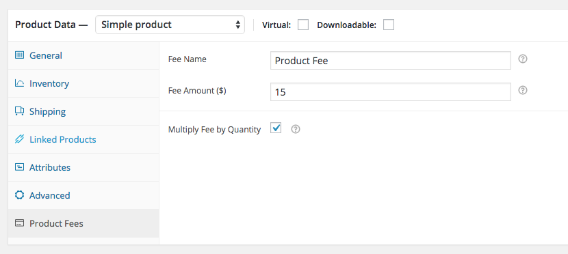
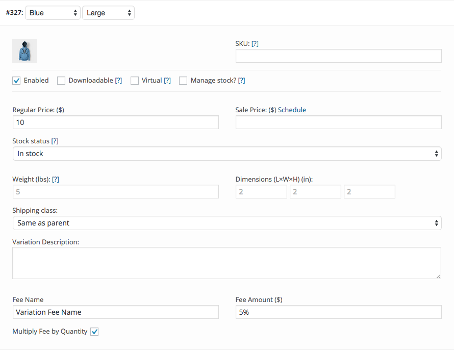
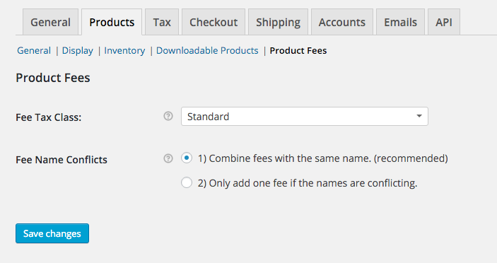
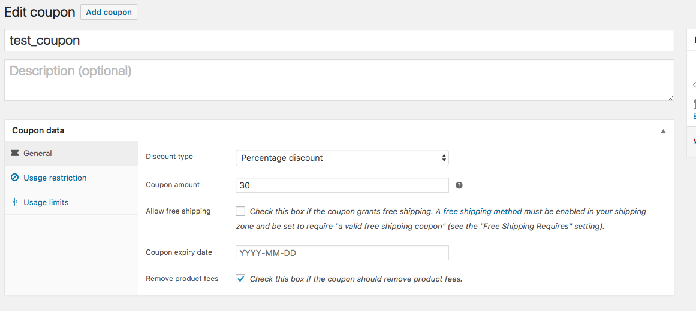
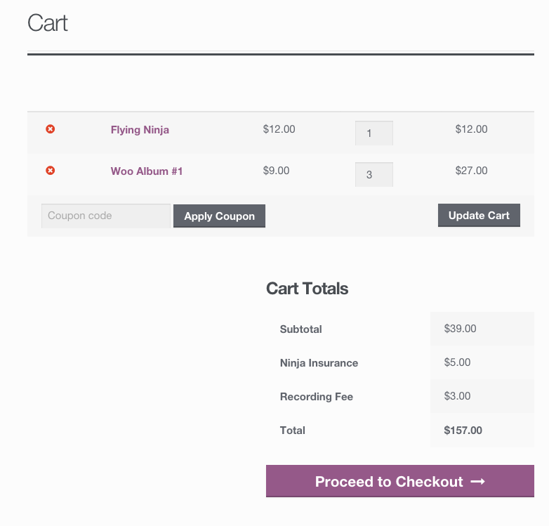

# WooCommerce Product Fees
WooCommerce Product Fees allows you to add additional fees at checkout based on products that are in the cart. You are currently at the GitHub repository, where you can browse the source, look at open issues, and keep track of development.

If you are not a developer, you can use the WooCommerce Product Fees [plugin page on WordPress.org](https://wordpress.org/plugins/woocommerce-product-fees/).

## Documentation
### Product Fees
In the WooCommerce products edit screen, there will be a new product data tab called 'Product Fees' where you can:

* Give the fee a custom name that is displayed to the customer at checkout describing the fee.
* Enter the cost of the fee as either a flat rate number or a percentage.
* Choose whether or not the fee should be multiplied based on the quantity of the product in the cart.

Product Settings:

### Variation Fees
There are also settings fields inside of each variation. If the variation does not have a fee, it will fallback and look to use the product fee if one exists.

Variation Settings:

### Plugin Settings
For the plugin settings, you can go **WooCommerce > Settings > Products > Product Fees**. Here you will find two settings:

* Fee Tax Class - Assign a tax class to be applied to fees, or leave it so fees are not taxed.
* Fee Name Conflicts - Choose whether fees with the same name should be combined or not.

Product Fee Settings:

Optional Coupon Setting:

Fees Shown at Checkout:

## Features

I have kept this plugin simple on purpose. It is very lightweight and should not conflict with any other plugins or themes. Here are the features included in the plugin:

* Percentage based fees that go off of the product's price.
* Variation specific fees.
* A quantity multiplier that can be toggled on/off per product and per variation.
* Option to combine fees with the same name.
* Ability to assign a tax class to be used on fees.
* Coupon setting that will remove fees when added.

## Support
This repository is not suitable for support. Please don't use the issue tracker for support requests, but for plugin issues only. Support can take place in the [WordPress.org forums](https://wordpress.org/support/plugin/woocommerce-product-fees).

## Contributing to WooCommerce Product Fees
If you have a patch, enhancement, or stumbled upon an issue - you can contribute this back to this plugin. Feel free to submit an issue or Pull Request!
